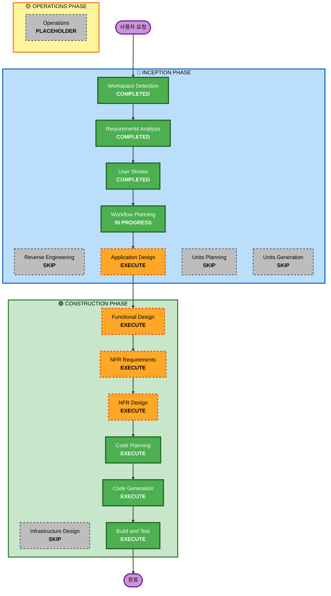

# 실행 계획

## 상세 분석 요약

### 변환 범위 (그린필드 프로젝트)
- **변환 유형**: 새 프로젝트 - 완전한 시스템 구축
- **주요 변경사항**: 테이블오더 시스템 전체 개발
- **관련 컴포넌트**: 고객 인터페이스, 관리자 인터페이스, 서버 시스템, 데이터 저장소

### 변경 영향 평가
- **사용자 대면 변경**: 예 - 완전히 새로운 고객 및 관리자 인터페이스
- **구조적 변경**: 예 - 이벤트 기반 아키텍처, 실시간 통신 시스템
- **데이터 모델 변경**: 예 - 메뉴, 주문, 테이블, 세션 데이터 모델
- **API 변경**: 예 - 새로운 REST API 및 SSE 엔드포인트
- **NFR 영향**: 예 - 실시간 성능, 동시성, 세션 관리

### 위험 평가
- **위험 수준**: 중간 - 복잡한 실시간 시스템이지만 명확한 요구사항
- **롤백 복잡성**: 쉬움 - 새 프로젝트이므로 롤백 불필요
- **테스트 복잡성**: 복잡 - 실시간 기능, 동시성, 다중 사용자 시나리오

## 워크플로우 시각화

## 실행할 단계

### 🔵 INCEPTION PHASE
- [x] Workspace Detection (완료)
- [x] Reverse Engineering (건너뜀 - 그린필드 프로젝트)
- [x] Requirements Analysis (완료)
- [x] User Stories (완료)
- [x] Workflow Planning (진행 중)
- [ ] Application Design - **실행**
  - **근거**: 새로운 컴포넌트와 서비스 설계 필요, 고객/관리자 인터페이스 분리, 실시간 통신 아키텍처 정의
- [ ] Units Planning - **건너뜀**
  - **근거**: 단일 통합 시스템으로 구성, 복잡한 단위 분해 불필요
- [ ] Units Generation - **건너뜀**
  - **근거**: Units Planning을 건너뛰므로 불필요

### 🟢 CONSTRUCTION PHASE
- [ ] Functional Design - **실행**
  - **근거**: 복잡한 비즈니스 로직 (세션 관리, 주문 처리, 실시간 업데이트) 상세 설계 필요
- [ ] NFR Requirements - **실행**
  - **근거**: 실시간 성능, 동시성, 보안, 확장성 요구사항 정의 필요
- [ ] NFR Design - **실행**
  - **근거**: SSE 실시간 통신, 이벤트 기반 아키텍처, 세션 관리 패턴 설계 필요
- [ ] Infrastructure Design - **건너뜀**
  - **근거**: 로컬 개발 환경만 대상, 복잡한 인프라 설계 불필요
- [ ] Code Planning - **실행** (항상 실행)
  - **근거**: 구현 접근 방식 계획 필요
- [ ] Code Generation - **실행** (항상 실행)
  - **근거**: 코드 구현 필요
- [ ] Build and Test - **실행** (항상 실행)
  - **근거**: 빌드, 테스트, 검증 필요

### 🟡 OPERATIONS PHASE
- [ ] Operations - **플레이스홀더**
  - **근거**: 향후 배포 및 모니터링 워크플로우

## 예상 타임라인
- **총 단계**: 7개 실행 단계
- **예상 기간**: 4-6주 (설계 1-2주, 구현 2-3주, 테스트 1주)

## 성공 기준
- **주요 목표**: 완전히 작동하는 테이블오더 시스템 구축
- **핵심 결과물**: 
  - 고객용 React.js 웹 인터페이스
  - 관리자용 React.js 웹 인터페이스  
  - Python/FastAPI 백엔드 서버
  - 파일 기반 데이터 저장소
  - SSE 실시간 통신 시스템
  - 포괄적 테스트 스위트
- **품질 게이트**:
  - 모든 사용자 스토리 수용 기준 충족
  - 실시간 업데이트 2초 이내 달성
  - 포괄적 테스트 커버리지 (단위, 통합, E2E)
  - 동시 사용자 시나리오 검증